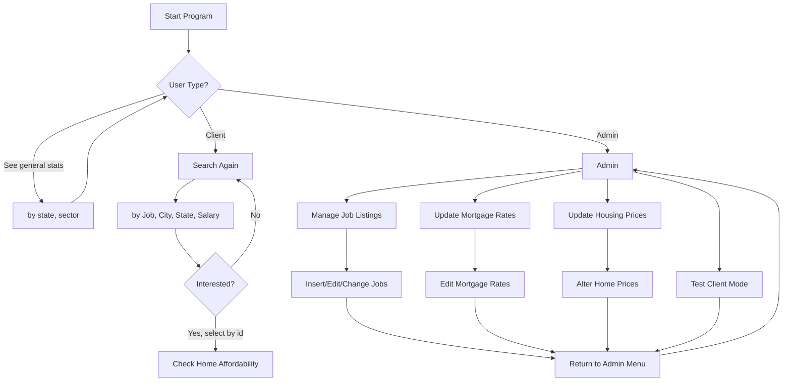

<span style="font-family: 'Comic Sans MS'; font-size: 2em;">affor-db</span>

## Overview
This project is designed to manage and analyze mortgage rates and jobs across different states. It provides tools for admins to manage job listings, update housing prices, and mortgage rates, while clients can search for jobs and check home affordability.


## Data

Partly sourced from Kaggle and Zillow except for the mortgage rates. That is proof-of-concept for now. All datasets used have been signficantly preprocessed and altered.

No data is written to the users system outside of in MySQL and this repository.

---

## Setup

### Prerequisites
- Python 3.x
- MySQL server

### Installation

1. **Clone the repository**:
    ```sh
    git clone https://github.com/BryOliveira/affor-db.git
    cd affor-db
    ```

2. **(optional) Create a Python venv**:
    ```sh
    python3 -m venv .venv
    source .venv/bin/activate
    ```

3. **Install the required Python packages (if not already installed)**:
    ```sh
    pip install -r setup/requirements.txt
    ```

4. **Set up the MySQL database**:
    - Ensure your MySQL server is running.
    - Create a database `affordb`
    - Create and update a `.env` file with the required fields:
        ```properties
        DB_HOST=localhost
        DB_PORT=3306
        
        #uncomment one of (a) or (b).

        # (a)
        # DB_USER=appclient
        # DB_PASSWORD=clientpw

        # or (b)
        DB_USER=appadmin
        DB_PASSWORD=adminpw

        DB_NAME=affordb
        ```

5. **Run the following to ensure db and functionality is properly populated**:

    ```sh
    **MAKE SURE YOU ARE IN THE setup/data folder!

    mysql> source setup.sql

    mysql> source load-data.sql

    mysql> source setup-passwords.sql
    
    mysql> source grant-permissions.sql

    mysql> source setup-routines.sql

    ```

---

## CLI APP Usage

### Running
To start the application, run (your variant of):
```sh
python app.py
```

Note that by default, there is a single admin, which can add other admins. The login is found at the bottom of setup-passwords.sql

### Application Features
- **Admin Mode**:
  - Manage job listings (add, edit, delete).
  - Update mortgage rates.
  - Update housing prices.
  - Test client mode.
- **Client Mode**:
  - Search for jobs by title, city, state, and salary range.
  - Check home affordability based on job salary and mortgage terms.

### Application Overview Flowchart


---

## Structure of backend

### Our Tables
1. **`home_prices`**:
   - Stores median house prices by state.
   - Columns: `loc_state`, `median_house_price`.

2. **`companies`**:
   - Stores company information, including sector and location.
   - Columns: `company_id`, `company_name`, `sector`, `loc_state`.

3. **`jobs`**:
   - Contains job listings with salary and location details.
   - Columns: `job_id`, `company_id`, `job_title`, `job_description`, `loc_city`, `loc_state`, `min_salary`, `max_salary`, `avg_salary`, `is_hourly`.

4. **`mortgage_rates`**:
   - Tracks mortgage interest rates by state, term length, and date.
   - Columns: `loc_state`, `loan_term_years`, `date_recorded`, `annual_interest_rate`.

### Some Views
1. **`v_jobs_with_annual_salary`**:
   - Standardizes job salaries to annualized values for easier comparison.

2. **`top_annual_salary_per_state`**:
   - Shows the highest annual salary for each state.

3. **`top_annual_salary_per_sector`**:
   - Shows the highest annual salary for each sector.

4. **`latest_mortgage_rates`**:
   - Displays the most recent mortgage rates for each state and loan term.

---

## Example Queries (hidden as the app is a CLI)

### Retrieve Job Details
```sql
SELECT 
    j.job_id, 
    j.job_title, 
    c.company_name, 
    j.loc_city, 
    j.loc_state, 
    j.min_salary, 
    j.max_salary,
    j.is_hourly
FROM jobs j
JOIN companies c ON j.company_id = c.company_id
WHERE j.job_id = 123;
```

### Calculate Monthly Mortgage Payment
```sql
SELECT calc_monthly_mortgage_payment(500000, 20, 'CA', 30) AS monthly_payment;
```

### Check Home Affordability
```sql
SELECT 
    j.loc_state,
    j.job_title,
    j.avg_salary, 
    calc_monthly_mortgage_payment(hp.median_house_price, 20, j.loc_state, 30) AS monthly_mortgage_payment,
    calc_affordability_ratio(
        j.avg_salary * 1000,
        calc_monthly_mortgage_payment(hp.median_house_price, 20, j.loc_state, 30)
    ) AS affordability_ratio
FROM v_jobs_with_annual_salary j
JOIN latest_mortgage_rates mr ON j.loc_state = mr.loc_state AND mr.loan_term_years = 30
JOIN home_prices hp ON j.loc_state = hp.loc_state
WHERE j.job_title LIKE '%Engineer%'
  AND j.loc_state IN ('FL', 'CA', 'NY')
ORDER BY j.loc_state;
```

---

