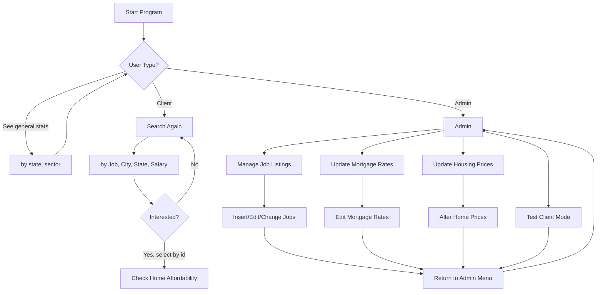
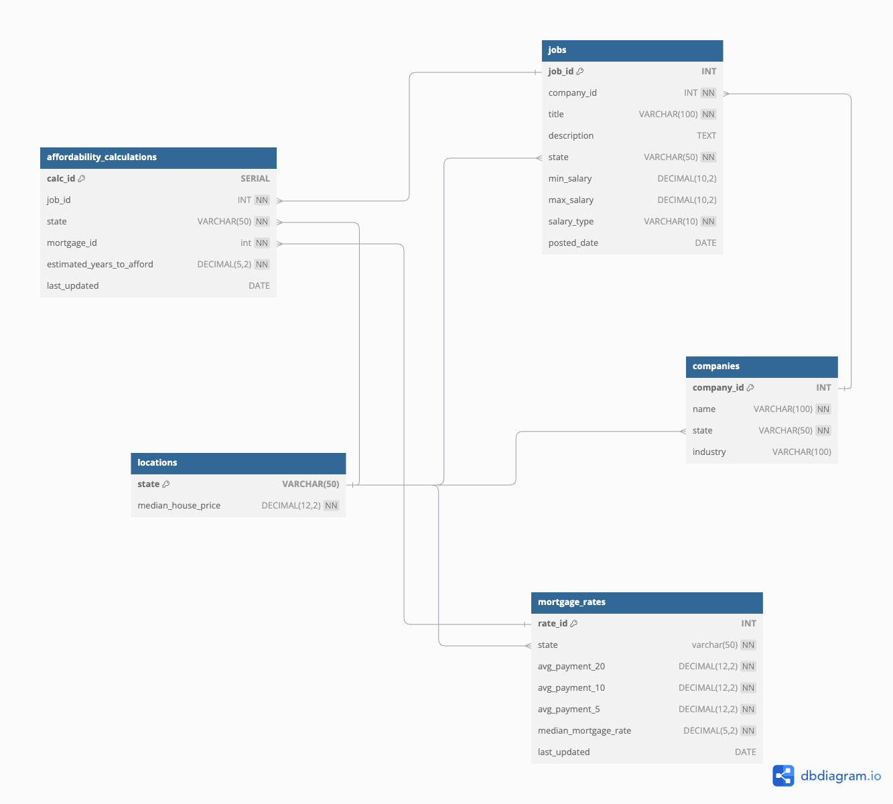

<span style="font-family: 'Comic Sans MS'; font-size: 2em;">affor-db</span>

## Overview
This project is designed to manage and analyze mortgage rates and jobs across different states.

## Setup

### Prereqs
- Python 3.x
- MySQL server

### Installation

1. Clone the repository:
    ```sh
    git clone https://github.com/BryOliveira/affor-db.git
    cd affor-db
    ```

2. Create a virtual environment, and activate it:
    ```sh
    python3 -m venv venv
    source venv/bin/activate
    ```

3. Install the required Python packages:
    ```sh
    pip install -r setup/requirements.txt
    ```

4. Set up the MySQL database:
- Ensure your MySQL server is running.
- Create a database and user for the project.
- Create and update a `.env` file with required fields
    ```properties
    DB_HOST=
    DB_PORT=
    DB_USER=
    DB_PASSWORD=
    DB_NAME=
    ```

5. Run our setup script to create the required SQL tables:
    ```sh
    mysql -u your_username -p your_database_name < setup/setup.sql
    ```

## Usage

### Running the Application
```sh
python app-template-24wi.py
```

### Application Overview Flowchart



### DB Overview


